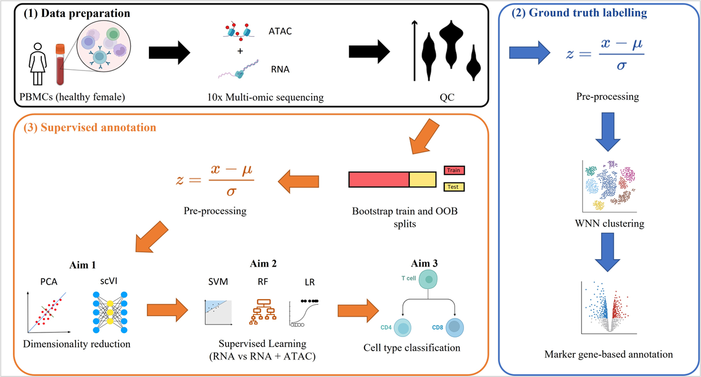

# Combining Single-cell ATAC and RNA Sequencing for Supervised Cell Annotation

## Abstract
**Motivation** <br>
Single-cell analysis offers insights into cellular heterogeneity and individual cell function. Cell type
annotation is the first and critical step for performing such an analysis. Current methods mostly utilize single-cell RNA
sequencing data. Several studies demonstrated improved unsupervised annotation when combining RNA with single-cell
ATAC sequencing, but improvements in supervised methods have not been explored.

**Results** <br>
Multi-omic peripheral-blood mononuclear cell (PBMC) and neuronal datasets were analyzed. Linear and nonlinear dimensionality reduction methods and classification models were evaluated. ATAC features improved annotation
quality and prediction confidence when using scVI embeddings to annotate PBMC sub-types but not neuronal cells. CD4
T effector memory cells showed the largest improvement in F1 score. Further studies should explore the use of ATAC to
improve the annotation of highly heterogeneous tissues such as tumours.

## Methods (Modelling)



The supervised annotation pipeline consisted of three steps. 
1. A 10x genomics multi-omic (RNA + ATAC) sequencing dataset describing peripheral blood mononuclear cells (PBMC) or neuronal cells was subject to quality control (QC) methods.
2. Ground truth labels were generated by using a pre-processing pipeline, followed by weighted nearest neighbours (WNN) clustering and marker gene-based annotation. These labels were used as ground truth for the supervised classification models.
3. Generated 10 bootstrapped train and out-of-bag (OOB) test sets. This was followed by pre-processing and dimensionality reduction using principal component analysis (PCA) or single-cell Variational Inference (scVI). Classification was then performed using support vector machine (SVM), random forest (RF) or logistic regression (LR) models. Models using RNA-only embeddings were compared to models using RNA and ATAC. 

## Data
[PBMC 10K Data](https://www.10xgenomics.com/resources/datasets/pbmc-from-a-healthy-donor-granulocytes-removed-through-cell-sorting-10-k-1-standard-1-0-0) 

[Alzheimer's Dataset](https://www.ncbi.nlm.nih.gov/geo/query/acc.cgi?acc=GSE214979)

## Files

The pipeline was run as follows:
1. Download the data (above) and place it in the corresponding subfolder within `/Data`
2. Perform quality control of feature-barcode matrix + ground truth annotation by running `Pre-processing.py`
3. Generate bootstrap X and y datasets using the quality-controlled data and run ML models to generate raw performance metrics (e.g. F1 scores) -> `boostrap.py`
4. Process metrics to generate statistical measures (e.g. Mean, CIs) -> `Results Analysis.py`
5. Perform statistical tests to compare performance between models (e.g. Wilcoxon test) -> `stats_test_bootstrap.R`

```
C:.
|   .gitignore
|   .Rhistory
|   bootstrap.py                # Generates bootstrapped embeddings and classification results using the original dataset
|   bootstrap_utils.py          # Utility functions for the bootstrap procedure
|   Interpretation dataset.py   # Generates dataset for interpretation
|   Interpretation Model.R      # Performs interpretation analysis (unpublished)
|   Pre-processing.py           # QC of the original dataset. This [muon tutorial](https://muon-tutorials.readthedocs.io/en/latest/single-cell-rna-atac/index.html) was used to guide pre-processing.
|   README.md
|   Result Analysis.py          # Processing of results
|   stats_tests_bootstrap.R     # Statistical test of classification results
|   Utils.py                    # Utility functions used in other Python scripts
+---Data
|   +---Figures
|   \---PBMC 10k multiomic      # Main PMBC dataset, includes annotation files
|       +---Bootstrap_X         # Bootstrapped feature sets
|       +---Bootstrap_y         # OOB label sets
|       +---Final Results
|       +---Interpretation
|       +---processed_data
|       |   +---Dim_Red
|       |   +---PCA
|       |   \---X_Matrices
|       \---Silhouette Scores
+---Supervised Models
|   +---Macro Metrics
|   +---PCA
|   +---Saved Models
|   \---scVI
|       
```
